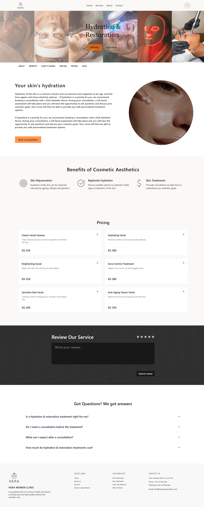

# Women Clinic - Beauty & Aesthetics Management

A modern, full-stack women's clinic web application built with Angular and a REST API backend. This project showcases a complete clinic website with service pages, online booking, user accounts, and a responsive UI for beauty and aesthetic treatments.

## Project Overview

Women Clinic is a comprehensive clinic website that allows visitors and clients to:

- **Home**: Explore hero section, services, doctors, reviews, and laser machine showcase
- **Services**: Browse treatment pages (Laser Hair Removal, Fillers, Skin Care, Hair Treatment)
- **About Us**: Learn about the clinic and team
- **Contact**: View clinic info, location map, working hours, and social links
- **Account**: Manage profile, view bookings, and change password (protected)
- **Booking**: Book appointments for treatments via the booking component

## Features

### Core Functionality

- **Authentication System**: Secure login/signup with JWT-style API auth
- **Protected Routes**: Account area guarded with `authGuard`; unauthenticated users are redirected
- **Service Pages**: Dynamic routes by slug (e.g. `laser-hair-removal`, `fillers`, `classic-treatment`, `oil-therapy`)
- **Booking**: Integrated booking flow for clinic appointments
- **User Profile**: User info, bookings list, and change-password sections
- **Clinic Info**: Contact page with header, contact details, map, social links, and working hours
- **Reviews & Ratings**: Display and manage clinic reviews
- **Doctors**: Showcase clinic doctors on the home page
- **Toast Notifications**: User feedback for actions and errors
- **Custom Title Strategy**: Page titles set per route (e.g. "Home", "About Us", "Contact Us")

### Technical Features

- **Lazy Loading**: Feature modules and profile child routes loaded on demand
- **HTTP Interceptors**: API base URL and error handling (e.g. 401 → "Please login first") centralized
- **Responsive Design**: Mobile-first layout with Tailwind CSS and DaisyUI
- **Standalone Components**: Angular 18 standalone components and lazy-loaded routes
- **Form Handling**: Reactive forms for login, signup, and profile (e.g. saved login form in `localStorage`)
- **Route Resolvers**: Dynamic page titles for service pages based on slug

## Tech Stack

### Frontend

- **Angular 18**: Modern Angular with standalone components, signals-ready
- **Angular Router**: Client-side routing, lazy loading, and route guards
- **Angular Forms**: Reactive forms for auth and profile
- **Angular Animations**: Smooth transitions and UI feedback
- **RxJS**: Reactive data flow and HTTP handling
- **Tailwind CSS**: Utility-first styling
- **DaisyUI**: UI component library and themes
- **Cally**: Calendar/booking-related functionality

### Development & Build

- **Angular CLI**: Scaffolding, build, and dev server
- **TypeScript**: Typed JavaScript
- **PostCSS / Autoprefixer**: CSS processing
- **Karma / Jasmine**: Unit testing

### Backend / API

- **REST API**: Backend at `https://women-clinic-apis--farahmmahfouz.replit.app/api/v1/`
- **Environment**: Configurable `apiUrl` in `src/app/core/utils/environment.ts`

## Project Structure

```
src/
├── app/
│   ├── app.component.ts          # Root component (layout, login/signup modals)
│   ├── app.config.ts             # App config (router, HTTP, interceptors, animations)
│   ├── app.routes.ts             # Main routes (home, services, about, contact, account)
│   ├── core/                     # Core utilities and singletons
│   │   ├── guards/
│   │   │   └── auth.guard.ts     # Protects /account
│   │   ├── interceptors/
│   │   │   ├── api.interceptor.ts    # Attach base API URL / headers
│   │   │   └── error.interceptor.ts  # Global error + toast
│   │   ├── pipes/
│   │   │   └── letter.pipe.ts
│   │   ├── services/
│   │   │   ├── auth.service.ts
│   │   │   ├── booking.service.ts
│   │   │   ├── doctor-scheduale.service.ts
│   │   │   ├── reviews.service.ts
│   │   │   ├── services.service.ts
│   │   │   ├── settings.service.ts
│   │   │   └── toast.service.ts
│   │   └── utils/
│   │       ├── appleTitle.strategy.ts  # Custom page titles
│   │       └── environment.ts         # API base URL
│   ├── features/                 # Feature-based modules
│   │   ├── about-us/
│   │   ├── auth/
│   │   │   ├── login/
│   │   │   └── signup/
│   │   ├── clinc-info/           # Contact page + header, map, hours, social
│   │   ├── home/                 # Hero, services section, doctors, reviews, etc.
│   │   ├── profile/              # Account (info, bookings, change password)
│   │   │   ├── components/
│   │   │   │   ├── change-password/
│   │   │   │   ├── sidebar/
│   │   │   │   ├── user-bookings/
│   │   │   │   └── user-info/
│   │   │   └── profile.routes.ts
│   │   └── services/             # Service pages by slug
│   │       ├── filler/
│   │       ├── hair-treatment/
│   │       ├── laser-hair-removal/
│   │       └── skin-care/
│   └── shared/                   # Reusable UI and layout
│       ├── components/
│       │   ├── benefits/
│       │   ├── booking/
│       │   ├── button/
│       │   ├── confirm-modal/
│       │   ├── control/
│       │   ├── faqs/
│       │   ├── footer/
│       │   ├── mini-navbar/
│       │   ├── modal/
│       │   ├── navbar/ (+ service-menu)
│       │   ├── pricing/
│       │   ├── ratings/
│       │   ├── review/
│       │   ├── section-container/
│       │   └── toast/
│       └── directives/
│           └── slideup.directive.ts
├── index.html
├── main.ts
└── styles.css
```

## 📸 Screenshots

### 🏠 Home Page


### 💎 Services Page




This README provides a high-level overview of the **Women Clinic** project, including:

- **Project description** — What the application does (clinic website, booking, account)
- **Features** — Core functionality and technical details
- **Tech stack** — Angular, Tailwind, DaisyUI, API, tooling
- **Project structure** — How the code is organized (core, features, shared)
- **Getting started** — How to run and build the project

---

## Getting Started

### Prerequisites

- **Node.js** (v18 or higher)
- **npm** (or another Node package manager)

### Installation

1. **Clone the repository**

   ```bash
   git clone <https://github.com/farahmahfouz/HERA-beauty-clinic>
   cd women-clinic
   ```

2. **Install dependencies**

   ```bash
   npm install
   ```

3. **Start the development server**

   ```bash
   npm start
   ```

   Or:

   ```bash
   ng serve
   ```

4. **Open in browser**  
   Navigate to **http://localhost:4200**


### Environment

- API base URL is set in `src/app/core/utils/environment.ts`.
- Switch between local and production API by changing `apiUrl` (e.g. `http://localhost:3000/api/v1/` for local backend).

---

## UI/UX Features

- **Responsive layout**: Works on desktop, tablet, and mobile
- **DaisyUI themes**: Consistent components and styling
- **Modals**: Login and signup as overlays; confirm and generic modals for actions
- **Toasts**: Success and error feedback (e.g. "Please login first" on 401)
- **Sections**: Hero, services grid, doctors, reviews, FAQs, pricing, benefits
- **Booking component**: Integrated appointment booking flow
- **Custom directives**: e.g. slide-up animations

---

## Authentication

The app uses a REST API for authentication:

- **Login**: `POST user/login` with email and password; token/session handled by backend
- **Signup**: `POST user/signup`; response type `AuthResponse` in `signup.ts`
- **Guard**: `authGuard` checks `AuthService.isLoggedIn`; redirects to `/` if not logged in
- **Saved form**: Login form can persist email in `localStorage` (`saved-login-form`) for convenience

---

## Deployment

- **Vercel**: Project includes `vercel.json` for deployment.
- Build output is in `dist/` after `ng build` (default project).

---

## Further Help

- [Angular CLI Overview and Command Reference](https://angular.dev/tools/cli)
- [Angular Documentation](https://angular.dev)
